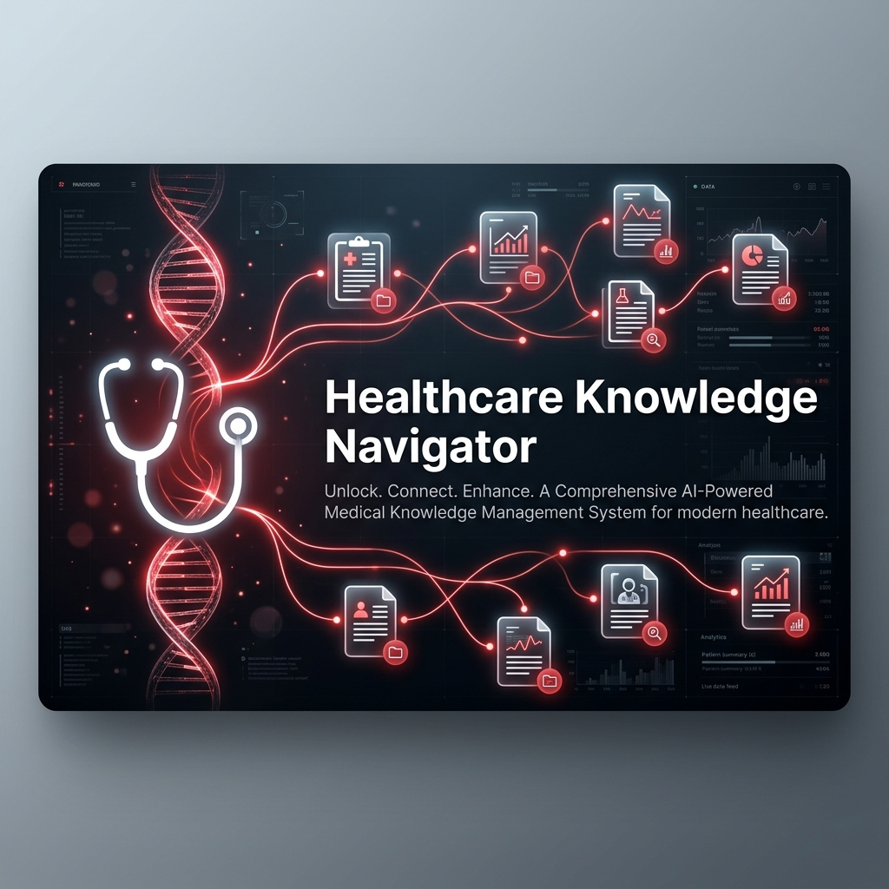

# Healthcare-Navigator-RAG
<p align="center">
  
</p>

<h1 align="center">🩺 Healthcare Knowledge Navigator</h1>

<p align="center">
  <strong>A production-grade, AI-powered medical assistant built on Retrieval-Augmented Generation (RAG)</strong>
</p>

<p align="center">
  
  
  
  
  
  
</p>

<p align="center">
  <a href="#-what-is-rag">What is RAG?</a> •
  <a href="#-features">Features</a> •
  <a href="#%EF%B8%8F-architecture">Architecture</a> •
  <a href="#-getting-started">Getting Started</a> •
  <a href="#-usage">Usage</a> •
  <a href="#-project-structure">Project Structure</a> •
  <a href="#-tech-stack">Tech Stack</a>
</p>

---

## 📖 About the Project

**Healthcare Knowledge Navigator** is a full-stack medical assistant that answers clinical questions using evidence from real medical literature. Unlike a generic chatbot that hallucinates answers, this system **retrieves actual clinical guidelines and research abstracts** from an indexed knowledge base and synthesizes them into accurate, citation-backed responses.

The system is powered by a **RAG (Retrieval-Augmented Generation)** pipeline that combines:
- **Semantic vector search** over 776+ indexed medical text chunks
- **Google Gemini 2.0 Flash** for intelligent answer synthesis
- **Intent classification** to distinguish casual conversation from medical queries

The knowledge base includes **226+ real clinical abstracts** scraped from **PubMed (NCBI)** across **50+ disease categories**, covering everything from diabetes and hypertension to oncology and neurology.

---

## 🧠 What is RAG?

**RAG (Retrieval-Augmented Generation)** is an AI architecture pattern that solves one of the biggest problems with Large Language Models: **hallucination**.

### The Problem with Standard LLMs
When you ask a standard LLM (like ChatGPT or Gemini) a medical question, it generates an answer from its training data. But:
- It can **hallucinate** facts that sound correct but are completely wrong
- It has **no access** to your specific documents, guidelines, or protocols
- It provides **no citations** — you can't verify where the information came from
- Its knowledge has a **cutoff date** and may be outdated

### How RAG Solves This

RAG adds a **retrieval step** before generation:

```
User Query
    │
    ▼
┌─────────────────────────┐
│  1. RETRIEVE            │  ← Search your own knowledge base
│     Vector similarity   │    (clinical guidelines, papers)
│     search in FAISS     │    and find the most relevant chunks
└──────────┬──────────────┘
           │
           ▼
┌─────────────────────────┐
│  2. AUGMENT             │  ← Inject the retrieved context
│     Build a prompt with │    into the LLM's prompt so it
│     retrieved context   │    only uses YOUR trusted data
└──────────┬──────────────┘
           │
           ▼
┌─────────────────────────┐
│  3. GENERATE            │  ← LLM synthesizes a natural
│     Gemini 2.0 Flash    │    answer grounded in the
│     generates answer    │    retrieved evidence
└─────────────────────────┘
           │
           ▼
   Cited, Accurate Answer
```

### Why RAG Matters for Healthcare
- ✅ **Grounded answers** — every claim is backed by a real source document
- ✅ **Verifiable citations** — users can trace answers back to specific guidelines
- ✅ **Up-to-date knowledge** — add new papers anytime, re-index, done
- ✅ **No hallucination** — the model can only use what's in the knowledge base
- ✅ **Domain-specific** — trained on YOUR clinical protocols, not random internet data

---

## ✨ Features

### 🔬 Intelligent Medical Q&A
- Ask any clinical question and receive evidence-based answers synthesized from indexed medical literature
- Each response includes **confidence scores** and **source citations** for full traceability
- Covers **50+ disease categories** from real PubMed abstracts

### 🧩 Smart Intent Classification
The system uses a **three-tier intent classifier** to route queries intelligently:

| Intent | Example | Handling |
|--------|---------|----------|
| **Greeting** | "Hi", "Hello", "Good morning" | Friendly welcome message |
| **Conversational** | "What can you do?", "Thanks" | System info, no RAG needed |
| **Medical** | "Treatment for Type 2 diabetes?" | Full RAG pipeline with citations |

### 💬 Multi-Session Chat Management
- **New Consultation** button starts a fresh chat session
- Current chat is automatically **saved to Saved Protocols** in the sidebar
- Click any saved protocol to **reload** that conversation
- **Delete** saved protocols with the trash icon

### 🎨 Premium UI/UX
- Sleek **red and white** glassmorphism design
- Responsive layout with fixed input bar at the bottom
- Animated typing indicators during response generation
- Smooth message transitions and hover effects
- Color-coded confidence badges (green ≥ 80%, red < 80%)

### 📚 Automated Data Ingestion Pipeline
- **PubMed scraper** (`scrape_pubmed.py`) fetches real clinical abstracts from NCBI's E-utilities API
- **Document ingestion** (`ingest.py`) processes `.txt` and `.pdf` files into vector embeddings
- **FAISS vector database** for blazing-fast similarity search

---

## 🏗️ Architecture

```
┌─────────────────────────────────────────────────────────────────┐
│                        FRONTEND (React + Vite)                  │
│  ┌──────────┐  ┌──────────────────┐  ┌───────────────────────┐  │
│  │ Sidebar  │  │   Chat Window    │  │    Input Area         │  │
│  │ - New    │  │   - Messages     │  │    - Text field       │  │
│  │   Chat   │  │   - Citations    │  │    - Send button      │  │
│  │ - Saved  │  │   - Confidence   │  │                       │  │
│  │   Chats  │  │     Badges       │  │                       │  │
│  └──────────┘  └──────────────────┘  └───────────────────────┘  │
└─────────────────────────────┬───────────────────────────────────┘
                              │ HTTP POST /api/query
                              ▼
┌─────────────────────────────────────────────────────────────────┐
│                     BACKEND (FastAPI + Python)                   │
│                                                                  │
│  ┌─────────────────┐    ┌──────────────────────────────────┐    │
│  │ Intent Classifier│───▶│ Greeting / Conversational Handler│    │
│  │ (Keywords+Regex  │    │ (Quick responses, no RAG)        │    │
│  │  +Gemini LLM)   │    └──────────────────────────────────┘    │
│  └────────┬────────┘                                            │
│           │ medical                                              │
│           ▼                                                      │
│  ┌──────────────────┐    ┌──────────────────┐                   │
│  │ FAISS Vector DB  │───▶│ Top-3 Relevant   │                   │
│  │ (776+ chunks,    │    │ Document Chunks  │                   │
│  │  MiniLM-L6-v2)   │    └────────┬─────────┘                   │
│  └──────────────────┘             │                              │
│                                    ▼                              │
│                          ┌──────────────────┐                    │
│                          │ Gemini 2.0 Flash │                    │
│                          │ (RAG Synthesis)  │                    │
│                          └────────┬─────────┘                    │
│                                   │                               │
│                                   ▼                               │
│                          Cited Answer + Confidence                │
└──────────────────────────────────────────────────────────────────┘
                              ▲
                              │ Indexed offline
┌─────────────────────────────┴───────────────────────────────────┐
│                     DATA PIPELINE                                │
│  ┌───────────────┐   ┌──────────────┐   ┌────────────────────┐  │
│  │ PubMed Scraper│──▶│ 51 .txt/.pdf │──▶│ ingest.py          │  │
│  │ (50+ diseases)│   │    files     │   │ (chunk → embed     │  │
│  └───────────────┘   └──────────────┘   │  → FAISS index)    │  │
│                                          └────────────────────┘  │
└──────────────────────────────────────────────────────────────────┘
```

---

## 🚀 Getting Started

### Prerequisites

- **Python 3.10+**
- **Node.js 18+** and **npm**
- **Google Gemini API Key** (free tier available at [Google AI Studio](https://aistudio.google.com/apikey))

### 1. Clone the Repository

```bash
git clone https://github.com/YOUR_USERNAME/HEALTHCARE-RAG.git
cd HEALTHCARE-RAG
```

### 2. Set Up the Backend

```bash
# Navigate to backend
cd backend

# Create and activate virtual environment
python -m venv venv

# Windows
.\venv\Scripts\activate

# Linux/Mac
source venv/bin/activate

# Install Python dependencies
pip install -r requirements.txt
pip install google-generativeai langchain-text-splitters
```

### 3. Ingest the Medical Data

The repository comes pre-loaded with 51 clinical documents. To build the vector database:

```bash
cd backend
python ingest.py
```

You should see:
```
Loading documents from 'data' directory...
Loaded 51 documents.
Chunking texts...
Split into 776 chunks.
Creating embeddings (downloading model if first run)...
Building FAISS database...
Database successfully saved to faiss_db
```

### 4. (Optional) Scrape More Data from PubMed

To expand the dataset with fresh abstracts from PubMed:

```bash
python scrape_pubmed.py
```

Then re-run the ingestion:
```bash
python ingest.py
```

### 5. Set Up the Frontend

```bash
# From the project root
cd ..
npm install
```

### 6. Run the Application

**Terminal 1 — Backend (FastAPI):**
```bash
cd backend

# Set your Gemini API key
# Windows PowerShell:
$env:GEMINI_API_KEY = "your-api-key-here"

# Linux/Mac:
export GEMINI_API_KEY="your-api-key-here"

# Start the server
python -m uvicorn main:app --reload --port 8000
```

**Terminal 2 — Frontend (Vite + React):**
```bash
# From project root
npm run dev
```

### 7. Open in Browser

Navigate to **http://localhost:5173** and start asking medical questions!

> **Note:** The system works without a Gemini API key too — it will fall back to returning raw retrieved chunks instead of synthesized answers.

---

## 💡 Usage

### Example Queries

| Query Type | Example | What Happens |
|------------|---------|--------------|
| 🩺 Medical | *"What is the first-line treatment for Type 2 diabetes?"* | RAG retrieval → Gemini synthesis → cited answer |
| 🩺 Medical | *"How is COPD managed?"* | Retrieves COPD treatment protocols with citations |
| 🩺 Medical | *"What are the screening guidelines for breast cancer?"* | Pulls oncology screening documents |
| 💬 Casual | *"What type of questions can I ask you?"* | Friendly capabilities overview (no RAG) |
| 👋 Greeting | *"Hello!"* | Warm welcome message |
| 🙏 Thanks | *"Thank you!"* | Polite acknowledgment |

### Managing Chat Sessions

1. **Ask questions** in the main chat area
2. Click **"+ New Consultation"** to save current chat and start fresh
3. Saved chats appear under **Saved Protocols** in the sidebar
4. Click a saved protocol to **reload** that conversation
5. Click the **🗑️ trash icon** to delete a saved protocol

---

## 📁 Project Structure

```
HEALTHCARE-RAG/
├── 📂 assets/
│   └── banner.png                  # README banner image
├── 📂 backend/
│   ├── 📂 data/                    # 51 clinical documents (.txt + .pdf)
│   │   ├── ADA_2025_Clinical_Guidelines.pdf
│   │   ├── asthma_treatment_protocol.txt
│   │   ├── breast_cancer_treatment_guidelines.txt
│   │   ├── COPD_treatment_protocol.txt
│   │   ├── depression_treatment_clinical_guidelines.txt
│   │   ├── type_2_diabetes_treatment_guidelines.txt
│   │   └── ... (51 files total)
│   ├── 📂 faiss_db/                # FAISS vector index (auto-generated)
│   │   ├── index.faiss
│   │   └── index.pkl
│   ├── main.py                     # FastAPI server + RAG pipeline
│   ├── ingest.py                   # Document ingestion & embedding pipeline
│   ├── scrape_pubmed.py            # PubMed abstract scraper
│   ├── evaluate.py                 # RAG evaluation script
│   └── requirements.txt            # Python dependencies
├── 📂 src/
│   ├── App.tsx                     # React chat UI component
│   ├── index.css                   # Global styles (red & white theme)
│   └── main.tsx                    # React entry point
├── index.html                      # Vite HTML entry
├── package.json                    # Node.js dependencies
├── vite.config.ts                  # Vite configuration
└── README.md                       # You are here!
```

---

## 🛠️ Tech Stack

### Backend
| Technology | Purpose |
|------------|---------|
| **FastAPI** | High-performance async Python API framework |
| **LangChain** | Document loading, text splitting, and vector store integration |
| **FAISS** (Facebook AI Similarity Search) | Local vector database for semantic search |
| **HuggingFace `all-MiniLM-L6-v2`** | Sentence transformer model for text embeddings |
| **Google Gemini 2.0 Flash** | LLM for intent classification and answer synthesis |
| **PyPDF** | PDF document parsing |

### Frontend
| Technology | Purpose |
|------------|---------|
| **React 19** | UI component framework |
| **TypeScript** | Type-safe JavaScript |
| **Vite 8** | Lightning-fast build tool and dev server |
| **Lucide React** | Beautiful icon library |

### Data Pipeline
| Technology | Purpose |
|------------|---------|
| **PubMed E-utilities API** | Source of real clinical abstracts |
| **RecursiveCharacterTextSplitter** | Intelligent document chunking (500 chars, 50 overlap) |
| **Sentence Transformers** | Embedding generation for vector search |

---

## 📊 Knowledge Base Coverage

The system currently indexes clinical literature across **50+ disease categories**:

<details>
<summary>📋 Click to expand full disease list</summary>

| Category | Document |
|----------|----------|
| Diabetes | `type_2_diabetes_treatment_guidelines.txt`, `ADA_2025_Clinical_Guidelines.pdf` |
| Cardiovascular | `hypertension_management_clinical.txt`, `heart_failure_treatment_guidelines.txt`, `atrial_fibrillation_management.txt` |
| Respiratory | `asthma_treatment_protocol.txt`, `COPD_treatment_protocol.txt`, `pneumonia_treatment_protocol.txt`, `sleep_apnea_treatment_guidelines.txt` |
| Oncology | `breast_cancer_treatment_guidelines.txt`, `lung_cancer_screening_guidelines.txt`, `colorectal_cancer_screening.txt`, `prostate_cancer_screening_guidelines.txt`, `cervical_cancer_screening_protocol.txt` |
| Neurology | `alzheimer_disease_management.txt`, `parkinson_disease_treatment.txt`, `epilepsy_treatment_guidelines.txt`, `migraine_treatment_guidelines.txt`, `stroke_prevention_guidelines.txt` |
| Mental Health | `depression_treatment_clinical_guidelines.txt`, `anxiety_disorder_treatment_protocol.txt` |
| Gastroenterology | `peptic_ulcer_treatment_protocol.txt`, `inflammatory_bowel_disease_treatment.txt`, `celiac_disease_management_guidelines.txt`, `gallstone_disease_treatment.txt`, `pancreatitis_management_guidelines.txt`, `chronic_liver_disease_management.txt` |
| Hepatology | `hepatitis_B_treatment_guidelines.txt`, `hepatitis_C_treatment_guidelines.txt` |
| Musculoskeletal | `osteoarthritis_treatment_guidelines.txt`, `rheumatoid_arthritis_treatment.txt`, `osteoporosis_management_guidelines.txt`, `gout_treatment_clinical_guidelines.txt` |
| Dermatology | `psoriasis_treatment_protocol.txt`, `eczema_dermatitis_management.txt` |
| Infectious Disease | `tuberculosis_treatment_protocol.txt`, `HIV_treatment_antiretroviral.txt`, `urinary_tract_infection_treatment.txt`, `sepsis_management_guidelines.txt` |
| Hematology | `anemia_treatment_guidelines.txt`, `iron_deficiency_treatment_protocol.txt`, `deep_vein_thrombosis_treatment.txt` |
| Endocrinology | `thyroid_disorder_treatment.txt`, `obesity_management_clinical_guidelines.txt` |
| Ophthalmology | `diabetic_retinopathy_screening.txt`, `glaucoma_treatment_guidelines.txt` |
| Nephrology | `chronic_kidney_disease_management.txt` |
| Metabolic | `hyperlipidemia_management_guidelines.txt`, `vitamin_D_deficiency_management.txt` |
| Pain | `chronic_pain_management_protocol.txt` |

</details>

---

## 🔑 Environment Variables

| Variable | Required | Description |
|----------|----------|-------------|
| `GEMINI_API_KEY` | Optional | Google Gemini API key for LLM-powered synthesis. Without it, the system falls back to returning raw retrieved chunks. Get one free at [Google AI Studio](https://aistudio.google.com/apikey). |

---

## 📝 API Reference

### `POST /api/query`

Send a natural language query to the medical assistant.

**Request Body:**
```json
{
  "query": "What is the first-line treatment for Type 2 diabetes?"
}
```

**Response:**
```json
{
  "answer": "Based on the ADA 2025 Clinical Guidelines, metformin remains the preferred initial pharmacologic agent for the treatment of type 2 diabetes [1]. However, early combination therapy should be considered...",
  "confidence": 87,
  "citations": [
    {
      "id": 1,
      "source": "type_2_diabetes_treatment_guidelines.txt",
      "snippet": "Metformin remains the preferred initial pharmacologic agent..."
    },
    {
      "id": 2,
      "source": "ADA_2025_Clinical_Guidelines.pdf",
      "snippet": "Section 9: Pharmacologic Approaches to Glycemic Treatment..."
    }
  ]
}
```

---

## Snapshots


---

## ⚠️ Disclaimer

> **This tool is designed for educational and research purposes only.** It is NOT a substitute for professional medical advice, diagnosis, or treatment. Always seek the advice of a qualified healthcare provider with any questions regarding a medical condition. The clinical guidelines indexed in this system may not reflect the most current evidence. Never disregard professional medical advice or delay seeking it because of information provided by this tool.

---

## 🤝 Contributing

Contributions are welcome! Here are some ways you can help:

1. **Add more clinical documents** to `backend/data/`
2. **Improve the intent classifier** with more patterns
3. **Add new features** like chat export, dark mode toggle, or user authentication
4. **Optimize the RAG pipeline** with re-ranking or hybrid search

---

## 📄 License

This project is open source and available under the [MIT License](LICENSE).

---

<p align="center">
  Made with ❤️ using RAG, FAISS, and Gemini
</p>
